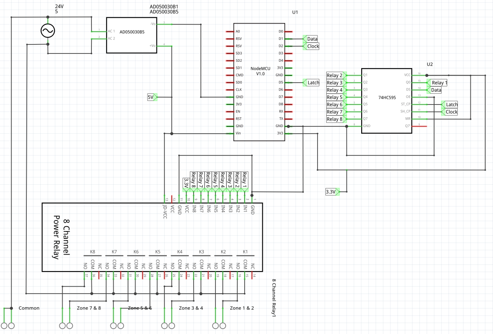

# smart-sprinkler

WiFi Based Sprinkler Controller using an ESP8266. Related articles on my blog:

* [Part 1 - Hardware](https://selfhostedhome.com/diy-wifi-sprinkler-controller-using-esp8266-part-1/)
* [Part 2 - Software](https://selfhostedhome.com/diy-wifi-sprinkler-controller-using-esp8266-part-2/)

## Hardware

The hardware is mostly based on an ESP8266 and 8 Channel relay board.



## Software

The software uses [esphome](). You can build and run the project by installing
esphome and running the following command:

```sh
esphome sprinkler_system.yaml run
```
